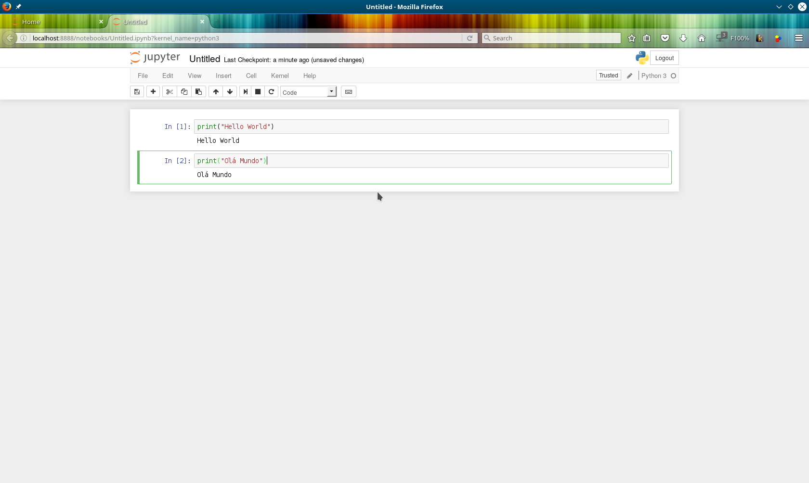
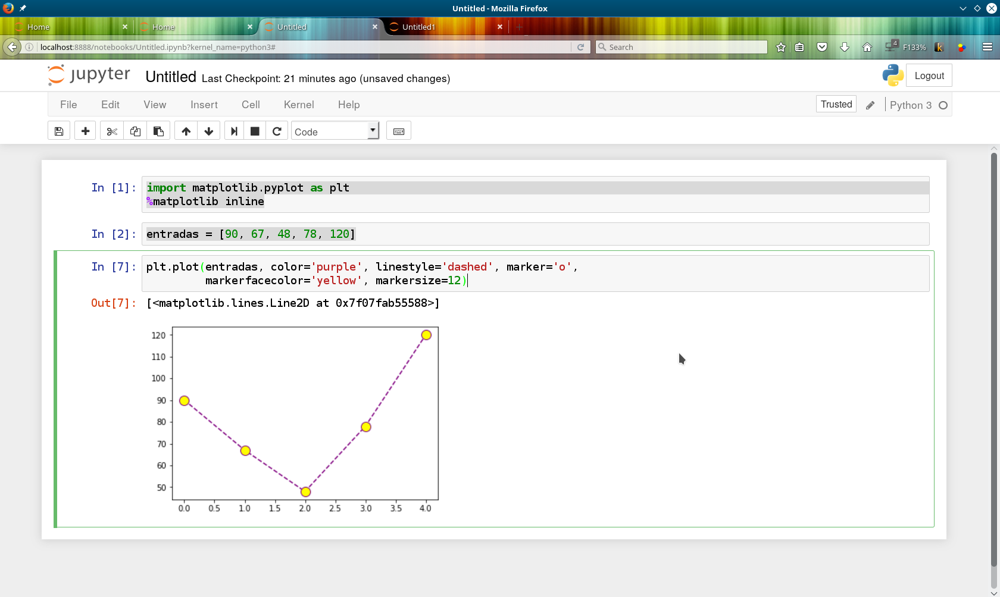

Introdução ao Python com Jupyter
================================

> Aviso aos hackers de plantão: este é um post para iniciantes com conceitos
> básicos. Se você já domina as artes obscuras do Python, volte em alguns dias
> para a parte II, analisando dados com `Pandas` e `Sklearn`. :)

Então você quer mexer com Python? Boa escolha. É uma linguagem bem bacana,
e tem um jeito bem legal de começar: usando seu browser. Graças ao
[Jupyter](http://jupyter.org). Chegaremos lá daqui a pouco, mas vamos
começar pela instalação do ambiente.


Instalação
----------

Temos que insyalar os pacotes do Python. Se você usa Linux, provavelmente já
tem o Python de fábrica. Como sempre acaba faltando alguma coisa, vamos
dar a receitinha de bolo. Além do Python, queremos o `pip` e o `virtualenv`,
que como veremos adiante, facilitam demais a vida.


### No Linux (Debian based)

```
$ sudo apt-get update
$ sudo apt-get install -y python3-pip build-essential \
  libssl-dev libffi-dev python-dev python3-venv
```

### No Mac
```
$ brew install python3
```

Pronto! A partir de agora vamos utilizar o `pip` para instalar os pacotes do
Python que nossos projetos exigirem. Isso será feito em uma pasta específica
para cada projeto, que chamaremos de ambiente virtual, ou **virtual env**.


Hello World
-----------

Vamos começar nosso `hello_world` (para mais detalhes sobre nomenclatura de
arquivos, classes e variáveis em Python, leia o
[PEP8](https://www.python.org/dev/peps/pep-0008), que é o principal guia
de estilo da linguagem). Seguiremos o seguinte roteiro:

1.  Criar uma pasta para o nosso projeto.
2.  Criar um ambiente virtual.
3.  Ativar o ambiente virtual.
4.  Criar o `hello_world`.
5.  Executar o `hello_world`.

```shell
$ mkdir learning_python    ## cria a pasta
$ cd learning_python    ## entra na pasta
$ virtualenv -p python3 env    ## cria o amviente virtual com python3 na pasta env
$ source env/bin/activate    ## ativa o ambiente virtual
$ atom hello_world.py  ## use o seu editor favorito :D
```

O conteúdo do arquivo deve ser algo como:

```python
#!/usr/bin/env python
print("Hello, World!!!")
```

Podemos executar de duas formas:

a. Chamando o Python passando o arquivo como argumento:

```shell
$ python hello_world.py
Hello, World!!!
```

b. ...Ou dando permissão de execução e chamando o script diretamente:

```shell
$ chmod a+x hello_world.py
$ ./hello_world.py
Hello, World!!!
```
Aeeeeeee! Parabéns, agora você já não é mais um inexperiente no Python.
Vamos avançar para o Jupyter?


Jupyter
-------

Da mesma forma que fizemos com o Hello World, vamos criar uma outra pasta
para o Jupyter (de preferência usando uma nova aba do seu terminal):

```shell
$ mkdir learning_jupyter    ## cria a pasta
$ cd learning_jupyter    ## entra na pasta
$ virtualenv -p python3 env    ## cria o amviente virtual com python3 na pasta env
$ source env/bin/activate    ## ativa o ambiente virtual
$ pip install jupyter matplotlib ## isso vai instalar o jupyter via pip
$ jupyter-notebook  ## isso vai abrir o jupyter no browser
```

Como mágica, uma janela deve se abrir com a interface web do Jupyter:


Clicando em **New > Python** somos apresentados à tela de edição de scripts onde
podemos digitar nosso código, que é diretamente interpretado e exibido ao
pressionar **CTRL + Enter**:



As caixas de texto são células, e cada uma pode ser executada separadamente.
O resultado aparece logo abaixo da célula.

As células podem receber código Python, mas também aceitam Markdown. Com isso é possível criar lindos códigos documentados. Veja esse exemplo:

Criamos as células dos tipos Markdown e Code:


Executamos todas as célulás:


Que demais! É tipo um texto, mas com partes executáveis. Imagina como deve ser bacana fazer
documentação técnica usando isso :D

Outra coisa bem interessante do Jupyter é a possibilidade de adicionar gráficos bonitos aos nossos documentos. Vamos brincar com números e aprender a fazer um **import**, ou seja, incluir código de uma
biblioteca externa. Adicione o código abaixo em 3 células de um novo notebook:

```python
import matplotlib.pyplot as plt
%matplotlib inline

entradas = [90, 67, 48, 78, 120]

plt.plot(entradas)
```

Fica assim:


Desta vez utilizamos a **Matplotlib** para desenhar um gráfico. Sempre que você quiser saber mais sobre como utilizar um método, pode chamar sua ajuda utilizando o **?**. Veja:


Vendo a ajuda podemos aprender novos parâmetros sobre as funções. Vamos reescrever o nosso gráfico com alguma opções mais bonitinhas:

```python
import matplotlib.pyplot as plt
%matplotlib inline

entradas = [90, 67, 48, 78, 120]

plt.plot(entradas, color='purple', linestyle='dashed', marker='o, markerfacecolor='yellow', markersize=12)
```

Olha como fica bem mais legal:



Tem outras bibliotecas bem legais para lidar com gráficos. Olha a Seaborn:


Uau, foi muita informação para um único post. É sempre bom recapitular:

1.  Teste os exemplos do post, instalando tudo do zero.
2.  Pratique o básico de Python até os olhos começarem a sangrar no teclado :)
3.  Leia a ajuda das funções, bibliotecas, etc.
4.  Procure mais referências, como [Code Academy](https://www.codecademy.com/pt-BR/learn/python), [Learn Python3 - The Hard Way](https://learnpythonthehardway.org/python3/), entre muitos outros.

Bônus: se você usa Linux, pode usar este script que instala o Jupyter com várias dependências e bibliotecas bem legais. Ele já instala o Pandas, Sklearn e Tensorflow, que utilizaremos nos próximos posts. [https://github.com/wesleyit/python_ipython_notebooks](https://github.com/wesleyit/python_ipython_notebooks).

É isso. Valeu, galera, dúvidas nos comentários e que o poder dos códigos esteja com vocês.
