Analisando dados com o Watson
=============================

A crise está aí, todo mundo já sentiu de alguma forma. Para conseguir uma grana
extra, além do meu trabalho como DevOps, decidi entrar como sócio em uma
padaria. Depois de 1 ano, decidi dar uma olhada nos números acumulados
a cada mês.

Foi mais ou menos assim:

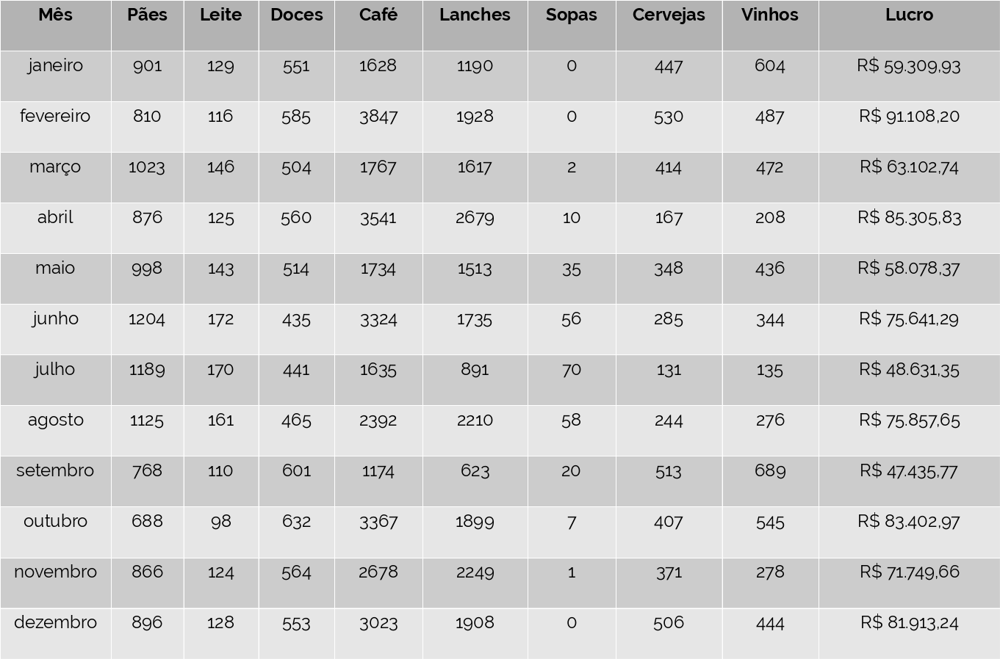

Só de olhar para os números é possível perceber os meses de maiores vendas,
dá para ver que não vendemos sopas nos meses de verão, enfim, algumas coisas legais.

Mas tem coisas que não somos capazes de ver só olhando, e principalmente com
conjuntos de dados maiores. Imagina só um conjunto com 100 colunas ao invés de 10?
Imagina se quiséssemos ver o intervalo de 10 anos ao invés de 1? Pois é. Precisamos
de ajuda. E agora, quem poderá nos ajudar?

Há uma gama enorme de ferramentas gratuítas para análise de dados. Em outros
posts vamos explorar opções usando mais programação com Python e R, mas por
enquanto vamos tentar algo mais fácil, visual e intuitivo: o **Watson Analytics**.

O Watson Analytics é um serviço da IBM que pode ser utilizado de graça (com
restrições no armazenamento, ou seja, se quiser salvar muitos dados precisa pagar).
Para quem quer aprender a ferramenta ou vai lidar com volumes pequenos de dados, é ótimo!

Para começar a brincadeira, vamos criar um login no Watson. Vamos acessar
[https://www.ibm.com/watson-analytics](https://www.ibm.com/watson-analytics) e
clicar em **Try it for free**.

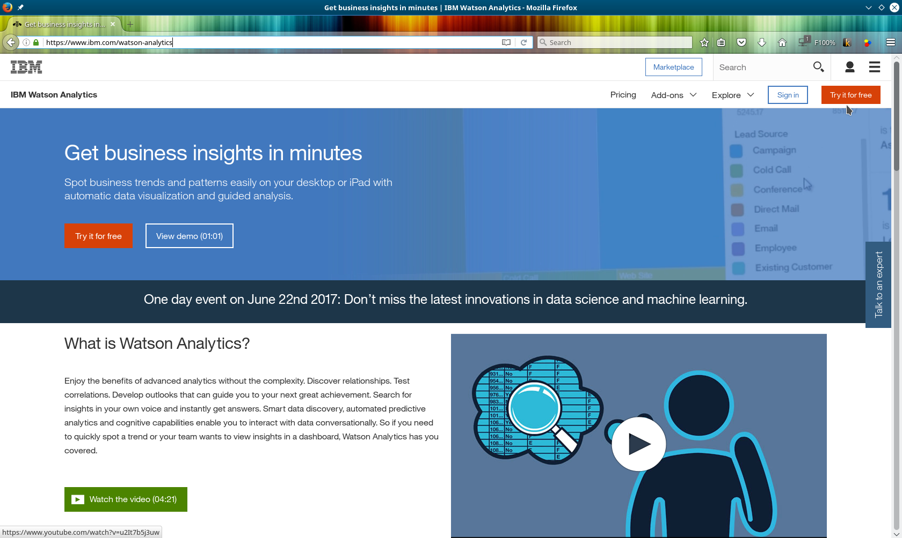

Siga com o processo de criação do ID IBM gratuíto,
até chegar à tela inicial do Watson:

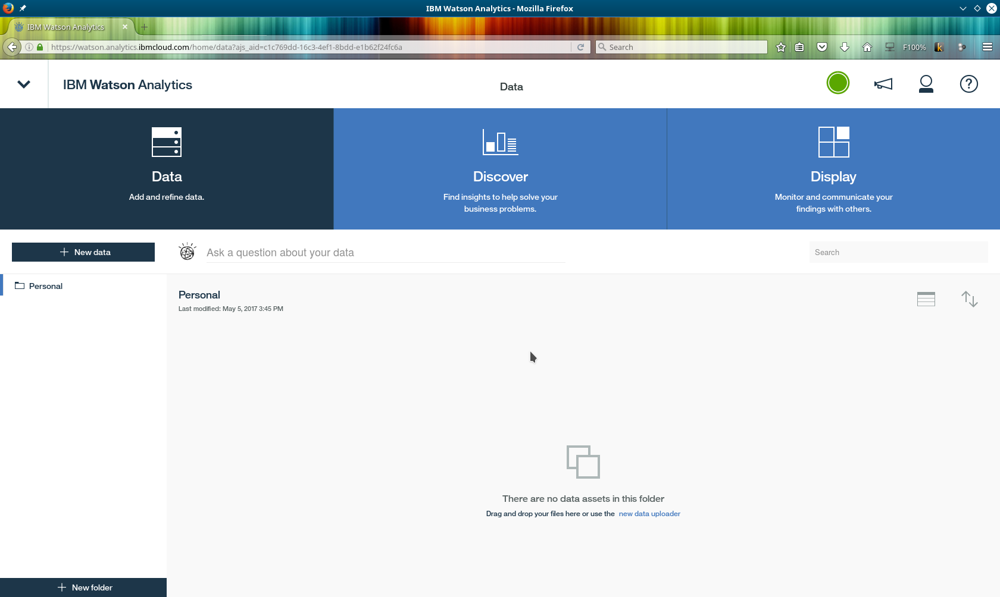

Para começar nossas análises, temos que enviar os dados para o Watson.
A tabela da minha padaria está disponível em formato `CSV` bem
[aqui](./padaria_2016.csv). Basta clicar em **New Data**, **Local File** e enviar o arquivo CSV. Fica assim:

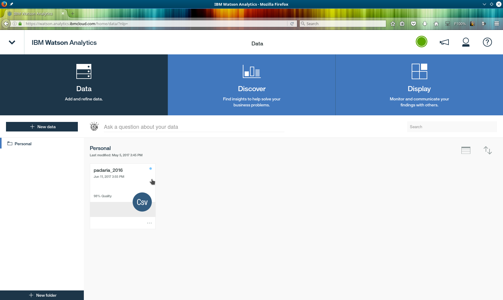

Boa! Agora que nosso arquivo subiu, precisamos refinar os dados.
Vejamos se tem algum campo que vamos remover, mudar o formato, ocultar, etc. Para refinar o arquivo é só clicar nos 3 pontinhos
abaixo da tag CSV e clicar em **Refine**.

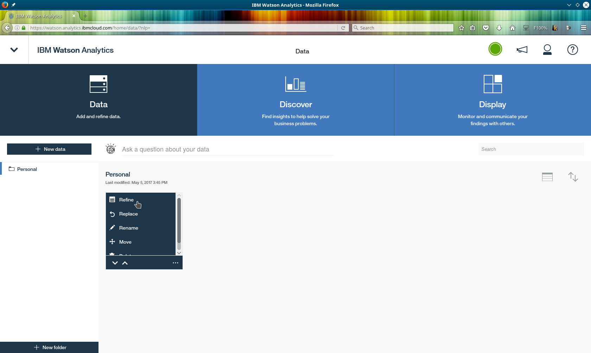

Na tela de refinamento tem vários botões na barra à esquerda. Eles habilitam os campos que mostram a qualidade dos dados, as estatísticas e tipos de dados.

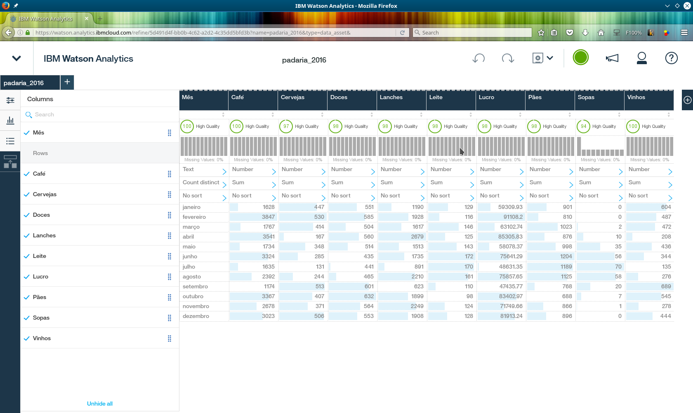

Olhando para os nossos dados, é bastante óbvio que a coluna mais importante é o **lucro**, certo? Então vamos marcar a coluna do lucro como **default target**, clicando no título da coluna e em **properties**.

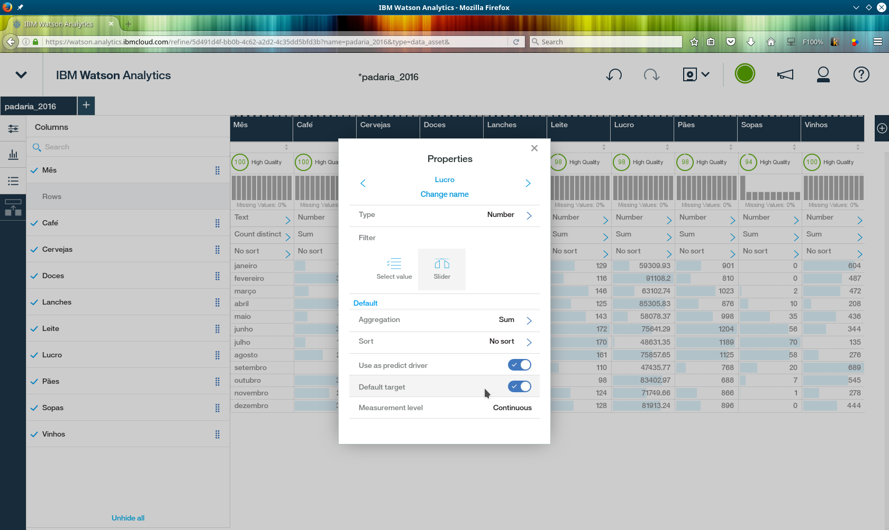

Depois de editar o arquivo, clique no botão **save**. Agora já podemos fechar o arquivo:

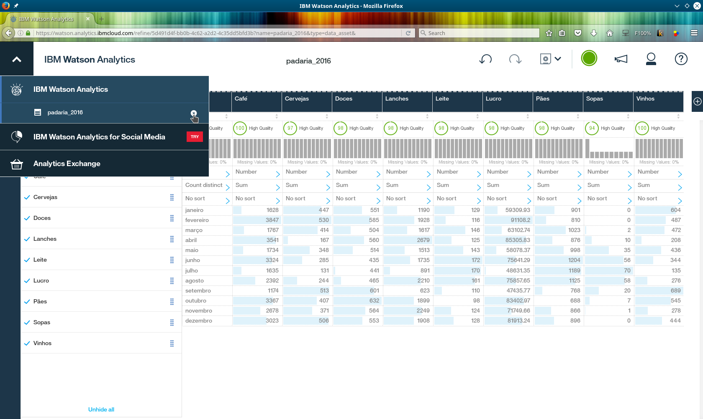

Observe que o ícone CSV deu lugar ao ícone REFINED. Clicando no ícone somos direcionados para a tela de **Discoveries**.

O próprio Watson sugere algumas análises. Vamos clicar na **What drives Lucro**:

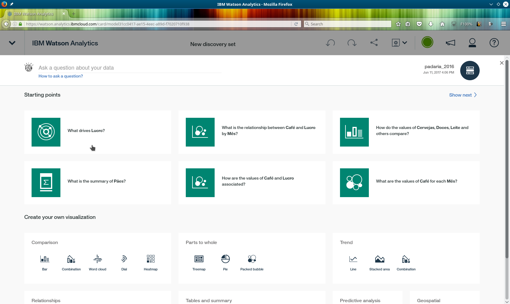

Olha que legal, ele mostrou que o café e os lanches são os produtos
que tem maior relação com o lucro:

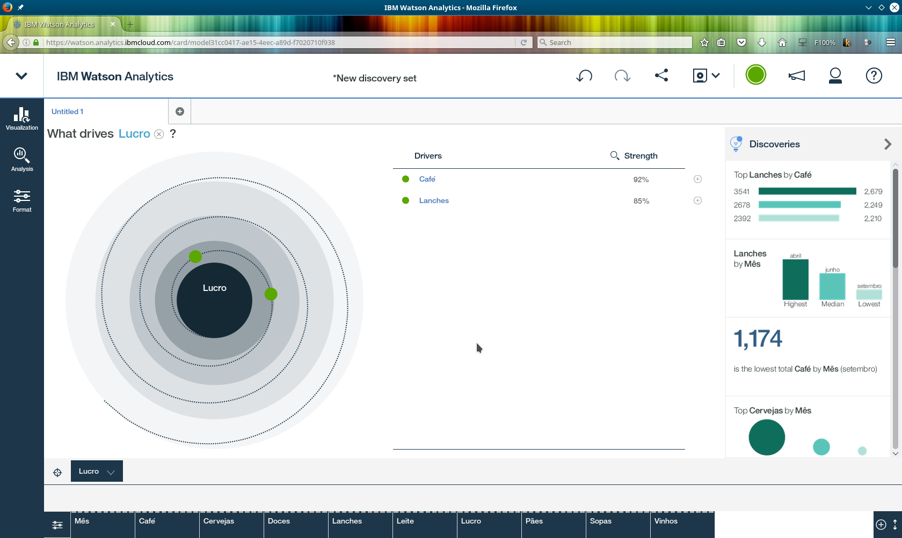

Clicando no botão **+** para abrir uma nova aba, voltamos à tela de discovery. Desta vez, vamos digitar uma pergunta. A pergunta pode ser em português mesmo, algo como:
*Qual a relação entre **Mês** e **Vinhos**?*

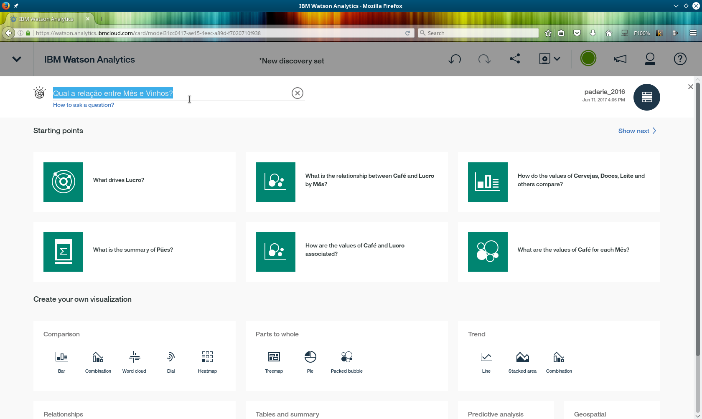

O Watson responde com gráficos relevantes, e clicando em um deles podemos ver os dados de vinhos por mês:

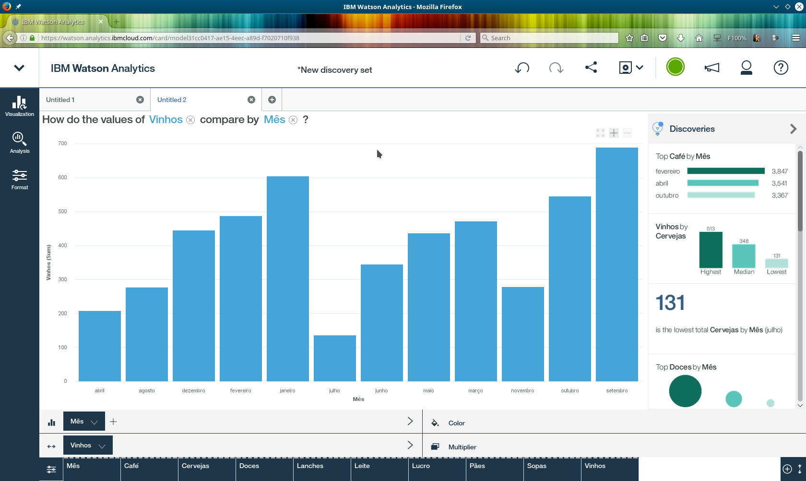

Depois de fazer várias descobertas, basta salvá-las, assim como fizemos com o CSV.

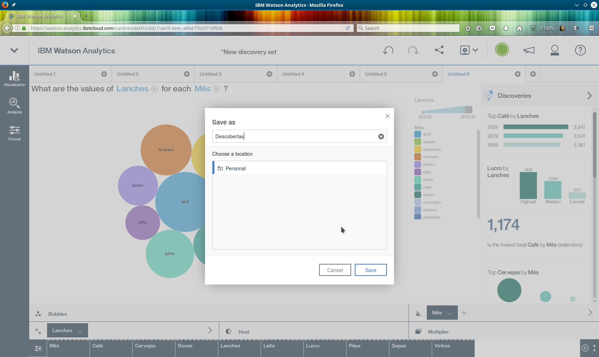

As descobertas ficam mais bonitas quando são agrupadas em um dashboard. Vamos criar um novo:

Agora basta encontrar os gráficos criados na descoberta e adicioná-los ao dashboard escolhido:

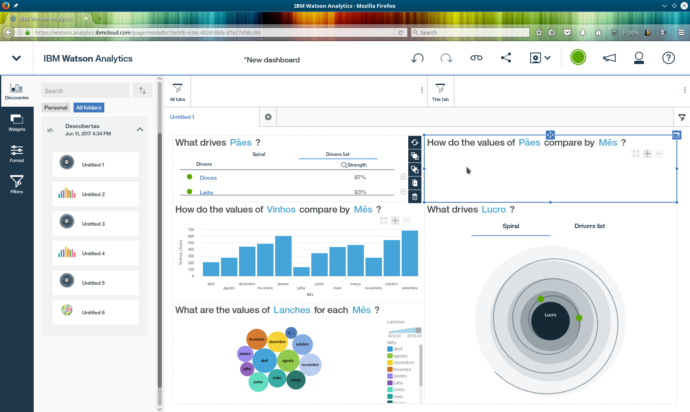

Show de bola. O Watson pode fazer muito mais do que mostramos: pode criar modelos preditivos, mostrar correlações, traçar linhas de tendência,
trabalhar com árvores de decisão, entre outros modelos estatísticos.
Mas não adianta muito focar apenas em ferramentas, temos que conhecer a teoria que move tudo isso, e é exatamente isso que faremos nos próximos posts. Por enquanto, explore bastante o Watson, utilize seus próprios dados ou datasets públicos nele e veja os resultados.

Ah, e sobre a padaria, era brincadeira. Inventei esses dados para mostrar o Watson :P
Não preciso da padaria, trabalhar na Concrete Solutions é só alegria $$$

E você? feche de vez sua padaria, pare de fazer freelas e venha trabalhar com a gente!
