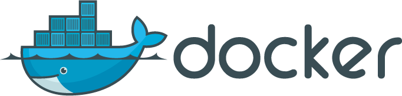
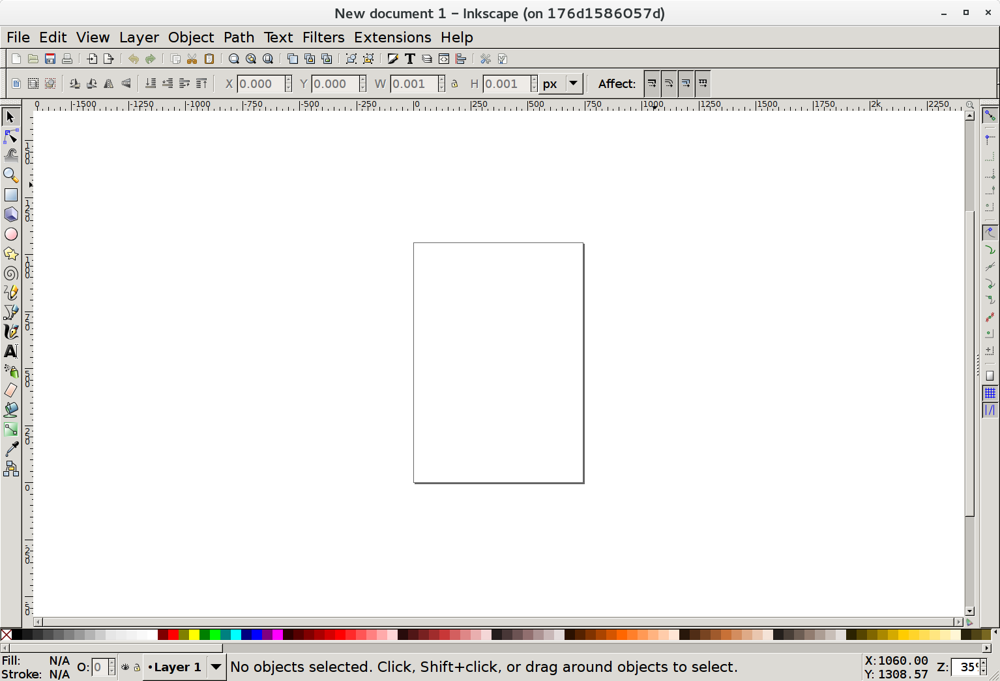
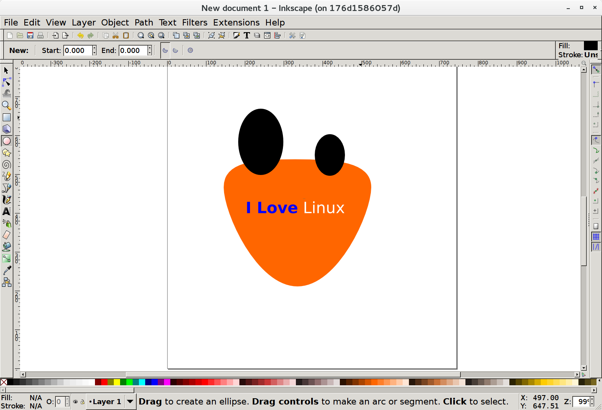
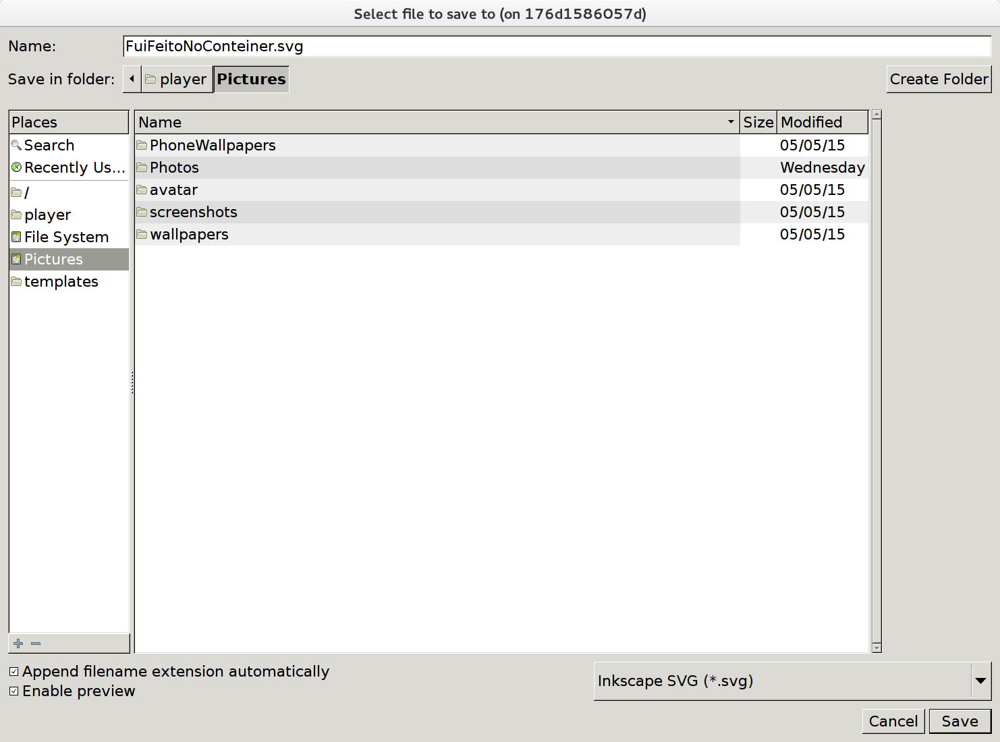
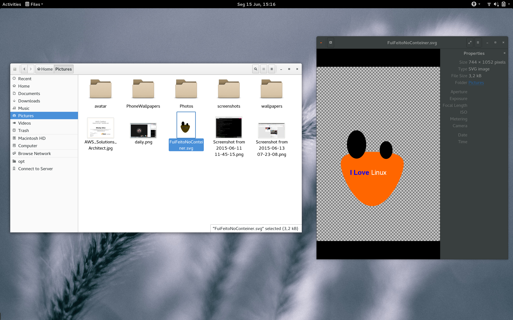

Como dockerizar minha aplicação Linux?
======================================


Historinha
----------
Eles chegaram para valer. Se você não se mover, pode ser atropelado por um contêiner.
Isso pode parecer exagerado, mas quando paramos para analisar o cenário das empresas líderes do mercado de TI, fica óbvio que não tem volta: a conteinerização é um paradigma que está se consolidando cada vez mais, passando por empresas como Google, Facebook, Amazon, DigitalOcean... até mesmo a Microsoft está criando mecanismos para dar suporte aos famigerados contêineres - uma tecnologia que nasceu no Unix.

Mas como isso ganhou tanta proporção? Historicamente muitos sistemas da família Unix já suportavam recursos parecidos com contêineres, cada um à sua maneira. Solaris e FreeBSD já usam contêineres há quase 15 anos, com o [Solaris Zones](http://www.oracle.com/technetwork/server-storage/solaris11/technologies/virtualization-306056.html) e o [FreeBSD Jails](https://www.freebsd.org/doc/handbook/jails.html). O ponto-chave dessa história é que uma coisa fácil de usar tem muito mais chance de "pegar" do que uma coisa complicada. E como eram complicados esses contêineres! Você precisava entender sobre processos, isolamento, compartilhamento de recursos e sistemas de arquivos.

Os anos foram passando, muitos desenvolvedores foram descobrindo o Linux e várias comunidades surgiram com os mais variados focos. A virtualização ganhou força e virou febre. Depois foi a vez da computação em nuvem e o boom da Amazon, até que alguém percebeu um brilho oculto no LXC e decidiu lapidá-lo. O LXC (LinuXContainers) é um conjunto de aplicações, templates, bibliotecas e SDKs para utilização de contêineres Linux bastante completo, mas não tão amigável. Aí entra o Docker. 


Docker.io 
---------
O papel do Docker foi fundamental para a disseminação dos contêineres: eles deixaram de ser tratados como distribuição de máquinas virtualizadas e passaram a distribuir **aplicações completas**. A ideia é a seguinte: você distribui um pacote com a sua aplicação e todas as dependências que seu app precisa, ganha uma plataforma web e um conjunto de ferramentas de automatização de build e publicação e ainda leva de brinde uma camada de isolamento e controle de recursos do sistema operacional (nas VMs isso era diferencial, nos contêineres é normalmente esquecida). Se quiser, ainda pode utilizar uma imagem imutável, tornando as coisas ainda mais garantidas.



No começo o Docker tinha sérios problemas: falhas de segurança, incompatibilidade com algumas versões do kernel e distribuições, falta de recursos, etc., mas a maioria dos problemas foi resolvida e muitas novas funcionalidades foram adicionadas. Hoje a plataforma está madura e começa a ter os primeiros concorrentes - RKT, LXD e Drawbridge, entre outros.


Tá, já sei tudo isso. Mas como eu dockerizo minha aplicação?
------------------------------------------------------------
Essa palavra feia, "dockerizar" - que só existe no dicionário tecniquês do DevOps - significa colocar sua aplicação para rodar dentro de um contêiner, de forma que ela possa ser distribuída e executada por outras pessoas.

Vamos precisar de uma máquina com Docker, Internet e um bom editor de texto (recomendo [o Vim](http://www.vim.org/), não porque precisa mas porque eu gosto mesmo). Utilizaremos neste exemplo a aplicação Inkscape, velho conhecido editor de imagens vetoriais. Mãos à obra?


Passo a Passo
-------------
Acho que a coisa mais importante na hora de distribuir sua aplicação em um contêiner é **conhecê-la: saber como ela funciona e de quais recursos ela depende**. Contêineres são leves. Se você usa 6GB para instalar um app simples, tem algo errado. Vamos partir de um sistema base pequeno e passo a passo instalar os pacotes e liberar o hardware. Mas ainda tem um outro conceito que precisamos ver...


Definitivo versus Descartável 
-----------------------------
Há duas maneiras básicas de trabalhar com os contêineres. Uma forma seria criar um contêiner, configurá-lo como precisar e utilizá-lo. Quando não estiver mais utilizando, pode simplesmente colocá-lo no estado "STOPPED" e na próxima vez que for necessário bastaria dar um "START" para continuar de onde parou. É assim que trabalhamos na maioria dos casos com máquinas virtuais, e somos condicionados a isso porque é deste modo que trabalhamos com nossos desktops e notebooks.

A segunda maneira é mais "DevOpsiana" (preciso parar de inventar palavras). Você inicializa um contêiner, usa para o que for necessário e joga fora. Isso mesmo. Deleta. Alguns poderão achar trabalhoso utilizar esta abordagem, mas na realidade ela é a maneira mais segura de se trabalhar: você garante que o contêiner sempre está como você precisa, ninguém alterou a imagem. Outros dirão que esta abordagem gera mais trabalho. Sim, é verdade, mas isso só se você não automatizar o build da imagem. Finalmente, alguns argumentarão que existem dados que precisam ser salvos. Sem problemas: é possível fazer um contêiner imutável e descartável e configurar os logs deste contêiner para serem redirecionados para um servidor de logs externo via rede. O mesmo vale para arquivos de dados: você pode utilizar um ponto de montagem de rede ou mesmo um volume Docker para salvar seus dados que devem persistir. Não tem mais desculpa. Desapega :)


Agora sim 
---------
Sem mais explicações, vamos lá. Vou presumir que você já tem um Docker funcionando no seu Linux. Caso queira, deixe uma mensagem nos comentários que eu mostro como fazer um setup bacana de Docker em um próximo post.

O primeiro passo é fazer o download da imagem que utilizaremos como base. Que tal um Debian Jessie? Ok.

`[wesley@localhost ~]$ docker pull debian:jessie`

Aguarde o progresso do download e você terá um Debian "fresquinho".

Existem várias abordagens para criar uma nova imagem. 
Quando vou dockerizar uma nova aplicação, eu costumo fazer o passo a passo "na mão" antes e depois gerar a imagem. 
Então faremos assim: 

1. Criamos um contêiner (interativo) do Debian.
2. Instalamos o Inkscape manualmente neste contêiner. 
3. Garantimos que o programa e suas dependências foram instaladas.
4. Depois de conhecer todos os passos, colocamos tudo em um Dockerfile para gerar nossa imagem.
5. Testamos uma nova instância a partir da nossa imagem com os ajustes *default*. 
6. Ajustamos o Dockerfile para conter mais parâmetros que façam a aplicação funcionar.

Execute este comando:

```
[wesley@localhost ~]$ docker run --rm -ti debian:jessie /bin/bash
root@6b6fe08fa678:/# 
```

Este comando executa um novo contêiner utilizando como base a imagem do Debian na versão Jessie. 
Note que este é um contêiner que tem uma sessão terminal interativa (`-ti`, que significa *tty* e *interactive*).
Também passamos o parâmetro `--rm`, que serve para excluir este contêiner quando a execução do processo terminar. Graças ao `--rm` nosso contêiner é descartável e as alterações não serão persistidas em nenhuma imagem.

Você será transportado imediatamente para o contêiner. 
A primeira coisa que fazemos quando queremos instalar algo em um Debian é atualizar a base de pacotes do repositório APT.
Como estamos usando o APT, as dependências de software serão instaladas automagicamente. 
Vamos automatizar nosso contêiner, lembre-se de não utilizar comandos que precisem de interação humana. 
Veja:

```
root@6b6fe08fa678:/# apt-get update -y
...
root@6b6fe08fa678:/# apt-get install -y inkscape
...
```

Após o download dos pacotes e dependências e da instalação dos pacotes, você terá um belo Inkscape instalado.
Mas será que ele funciona? Vamos ver?

``` 
root@8f0100a1c69c:/# inkscape 
Nothing to do!
```

Que mal criado! Sabemos que o Inkscape pode rodar em modo texto e em GUI.
Vamos tentar forçar o uso da GUI:

```
root@8f0100a1c69c:/# inkscape --with-gui
(inkscape:11): Gtk-WARNING **: cannot open display: 
```

Ahá! Lendo a mensagen fica claro que o Inkscape está instalado e executando corretamente.
O software só não abriu porque não achou o X11.
Agora é hora de criar a nossa imagem. Vamos cuidar deste detalhe do X11 na inicialização do contêiner.

Para começar a imagem, vou executar `vim Dockerfile` para criar um novo arquivo.
Vou explicar cada parte do arquivo nos comentários:

```
# O FROM serve para indicar a imagem utilizada como base.
FROM debian:jessie

# MAINTAINER é quem cria a imagem.
MAINTAINER Wesley Rodrigues da Silva <wesley.it@gmail.com>

# O RUN executa comandos durante o build, que serão
# refletidos na imagem final. Há várias formas de passar
# os parâmetros, eu costumo utilizar esta:
## Vamos atualizar o APT.
RUN ["apt-get", "update"]

## E instalar o Inkscape
RUN ["apt-get", "install", "-y", "inkscape"]

## Finalmente vamos criar o login player, não é legal
# usar root para tarefas onde não precisamos deste privilégio.
# O ID deste usuário deve ser igual o ID da pessoa que executa o contêiner,
# que geralmente é 1000.
RUN ["useradd", "player", "-u", "1000", "-g", "100", "-m", "-d", "/home/player", "-s", "/bin/bash"]

# USER faz com que você troque o ID que está executando os
# comandos a seguir.
USER player

# ENTRYPOINT define o comando que executará quando o contêiner
# for executado a partir da imagem.
ENTRYPOINT ["/usr/bin/inkscape"]
```

Agora que temos o nosso Dockerfile, já podemos executar o comando de build para gerar a imagem:

`[wesley@maclinux: ~]$ docker build -t meu-inkscape .` 

A opção -t define uma *tag* que serve para dar o nome à nossa imagem.
O ponto serve para dizer que o Dockerfile está no diretório atual.

```
[wesley@maclinux: ~]$ docker build -t meu-inkscape .
Sending build context to Docker daemon 2.495 MB
Sending build context to Docker daemon 
Step 0 : FROM debian:jessie
 ---> 41b730702607
Step 1 : MAINTAINER Wesley Rodrigues da Silva <wesley.it@gmail.com>
 ---> Using cache
 ---> 86ce4a60506a
Step 2 : RUN apt-get update
 ---> Using cache
 ---> c33099423d19
Step 3 : RUN apt-get install -y inkscape
...
```

Cada comando que colocamos no Dockerfile gera um "Step".
Cada step é na verdade um contêiner - observe os IDs no log de build.
A vantagem de fazer múltiplos contêineres utilizando um comando por linha é que  
se um passo dá errado, você continua de onde parou. O Docker mantém um cache de contêineres e utiliza este cache para os passos idênticos que são solicitados novamente, poupando tempo e banda. 

Nosso processo deve estar acabando, vejamos:

```
Step 6 : ENTRYPOINT /usr/bin/inkscape
 ---> Running in b0e61aefe2e3
 ---> e85b654d5c73
Removing intermediate container b0e61aefe2e3
Successfully built e85b654d5c73
```

Nosso comando disse que deu tudo certo.
Vamos agora tentar subir um contêiner com essa imagem.
Devemos ver uma tela de erro igual àquela que vimos quando rodamos na mão:

```
[wesley@maclinux: ~]$ docker run -ti --rm meu-inkscape
Nothing to do!
```

Perfeito! Nossa imagem está funcionando. 
Na teoria, para tudo funcionar agora basta entregarmos o X11 para o contêiner.

Mas como fazer isso?
Existe um modo bem legal. Podemos mandar para dentro do contêiner um socket do X11.
Para isso temos que sair do contêiner, dar permissão no socket e subir novamente compartilhando uma pasta.
Vamos rodar uns comandos no nosso SO e depois iniciar novamente o contêiner com alguns novos parâmetros.

Para dar acesso ao X11:

``` 
[wesley@maclinux: ~]$ xhost +
access control disabled, clients can connect from any host
```

Agora vamos iniciar o contêiner novamente. Desta vez, passaremos como argumento o caminho do socket do X11, e também informaremos via variável de ambiente qual DISPLAY deve ser utilizado. No meu caso o display é o 0, mas no seu caso pode ser diferente. 
Execute um `echo $DISPLAY` na sua máquina para saber o seu. Depois, inicialize o contêiner da seguinte forma:

```
docker run -ti --rm \
-e "DISPLAY=unix:0" \
-v /tmp/.X11-unix:/tmp/.X11-unix \
-v $HOME/Pictures:/home/player/Pictures \
meu-inkscape 
```



Sucesso! Note que passamos um parâmetro de mapeamento de pasta para nosso Inkscape. 
Ele mapeia a pasta Pictures do seu usuário para a pasta Pictures do contêiner.
Com isso, você será capaz de trocar arquivos com seu novo Inkscape, mesmo tratando de um contêiner totalmente descartável.

Faça um desenho bem bonito e salve na pasta `~/Pictures` do contêiner.





Depois, acesse a mesma pasta no seu usuário e aí você deve ser capaz de visualizar o arquivo.




The end 
-------
É isso, pessoal. Espero que vocês tenham conseguido entender o "espírito da coisa".
Se tem alguma aplicação em especial que você queira que a gente *dockerize*, peça nos comentários.
Deixe aqui também as suas dúvidas, sugestões, elogios ou críticas.
Abraço!

